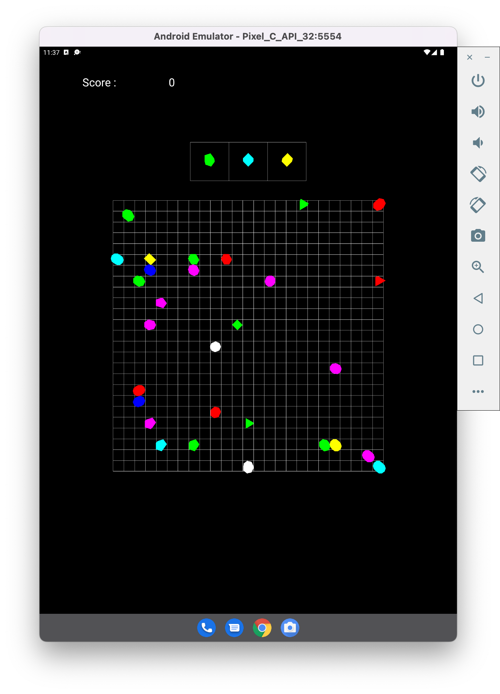

#Klines OpenGL
## A color lines game
Jean-Daniel de Ambrogi
2183171
### Travail réalisé
Après être partie d'une activity et du renderer j'ai developpé plusieurs classes permattant de créer et gérer facilement les diférents objects du jeu ainsi que la logique de celui-ci.
Au niveau OpenGL on retrouve donc un object builder qui va être apppelé par chaque classe d'objet (grille, piece...). Celui-ci assemble des formes géométriques basique disponibles dans `Geometry`. Le builder va surtout s'occuper de déclarer les points dans un buffer et créer l'ensemble des commandes `draw` correspondantent (comme GL_LINES, GL_TRIANGLE, GL_TRIANGLE_STRIP...). Le renderer peut alors appeler le draw de ces objets après les avoir positionnés et lié les shaders.
La logique du jeu est telle qu'à chaque touchEvent on vérifie si on touche une piece ou une case vide. Si après avoir touché une piece on touche une case vide on va lancer la vérification du chemin avec un parcours en largeur pour voir si le cheminement est possible. Si oui on va interdire les touch events et lancer le mouvement de la piece, toutes les 125 ms la piece va bouger.
Après on vérifie l'état de la grille et le possibles pièces à supprimer ainsi que créer les nouvelles pieces. Si la grille est pleine on lance le game over.
La projection est en 3D, en changeant décommentant la ligne 190 du renderer on peut avoir une vue avec une projection différente.
### Remarque
Lors du mouvement de la piece j'ai dû faire face à des `nullPointerException` (Klines_renderer.java, l.157) alors qu'après l'exécution des méthodes on ne doit jamais en avoir. Au niveau de `proceed_movement` on échange les postions des pièces mais on ne laisse pas de null là où il ne devrait pas y en avoir. L'hypothèse serait donc que le call de `onDrawFrame se fasse dans un autre thread, alors même que l'échange de position est en cours. On peut aussi penser que le `onDrawFrame puit interrompre les méthodes. Si bien que peut élégant on teste donc dans ce dernier si les pieces sont nulles avent de les dessiner.
### Fonctionnement du jeu
Il y a trois modes disponibles :
- Facile : Grille 7×7 avec des alignements de 4 pièces.
- Normal : Grille de 9×9 avec des alignements de 5 pièces.
- Personnalisé : Grille de taille minimal 6 et maximal... ce que l'appareil peut supporter.
  
  
- Lors d'un game over on affiche le score et on retourne au menu principal.

